# Static web app invoking Azure functions

The aim of this repository is to demonstrate how to deploy a [static website](client/src/App.js) written in React to a [Storage Blob](https://learn.microsoft.com/en-us/azure/storage/blobs/storage-blob-static-website). The
hosted SPA allows users to upload CSV files containing demographic and financial data about individuals. The files are uploaded to a storage blob by calling an HTTP-triggered Azure Function with the appropriate output bindings. 
Once the CSV has been uploaded to the storage blob, another, blob-triggered Azure Function calculates correlations between various variables, such as experience, state, gender, and income. 
The computed statistics are then stored in a new blob container, which is used to serve the results to the user.
These two functions are defined in the python script [function_app.py](hvalfangst_function/function_app.py) - which is the main entrypoint of our Azure Function App instance.

The SPA is protected with Oauth2.0 authorization code flow with PKCE and OIDC. The user is redirected to the Azure AD login page, where they must authenticate before being redirected back to the SPA.


The associated Azure infrastructure is deployed with a script (more on that below).

A branch-triggered pipeline has been set up to deploy our code to the respective Azure resources using a GitHub Actions Workflows [script](.github/workflows/deploy_to_azure.yml). 
The two functions are deployed using the Function App's associated **publish profile**, whereas the static web app is deployed using a **Service Principal** configured with a **Federated Credential**. 
Note that the static website is hosted directly from a storage blob, as our associated storage container has been configured to serve static websites in our resource provisioning script. 
Thus, deploying the website is simply a matter of uploading the static files to the designated blob container.


## Requirements

- **Platform**: x86-64, Linux/WSL
- **Programming Languages**: [React](https://reactjs.org/docs/getting-started.html), [Python 3](https://www.python.org/downloads/)
- **Cloud Account**: [Azure](https://azure.microsoft.com/en-us/pricing/purchase-options/azure-account)
- **Resource provisioning**: [Azure CLI](https://learn.microsoft.com/en-us/cli/azure/)


## Allocate resources

The shell script [allocate_resources](infra/allocate_resources.sh) creates Azure resources using the Azure CLI in conjunction with a
[Bicep](https://learn.microsoft.com/en-us/azure/azure-resource-manager/bicep/overview?tabs=bicep) template [file](infra/main.bicep). 

It will create the following hierarchy of resources:

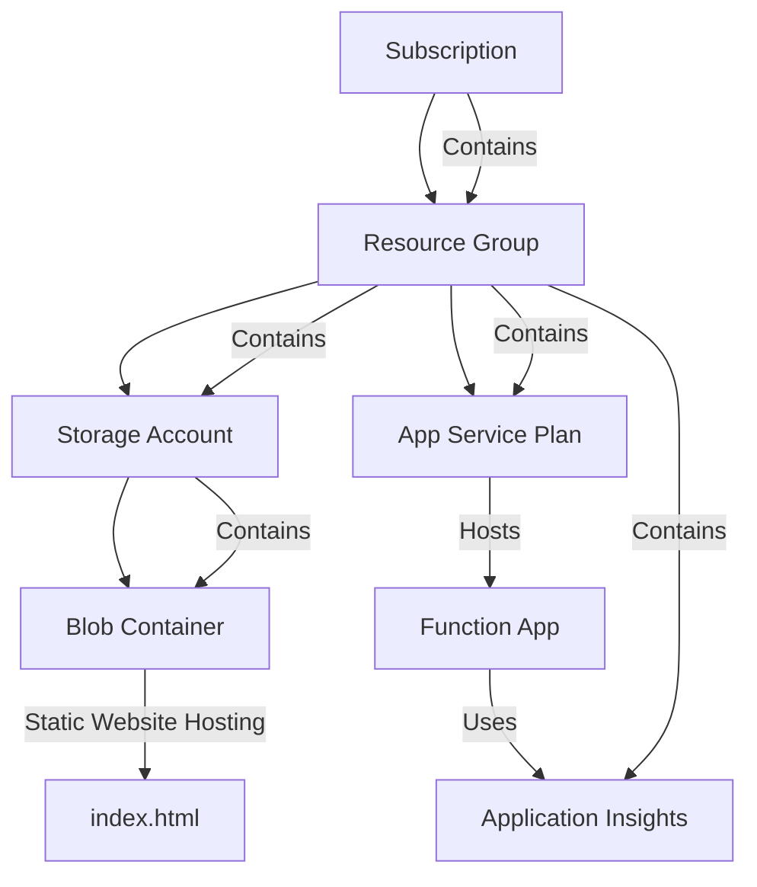

## Registrations
In addition to the resources listed above, the script will also create a **service principal** and two Microsoft Entra ID **app registrations.** 

### Service Principal for GitHub Actions
The service principal has been assigned contributor role to our resource group, which is sufficient in order to deploy the static web app to the storage blob.
It has been assigned a federated credential configured to work with this repository as it is utilized in our CI/CD [GitHub Actions Workflow script](.github/workflows/deploy_to_azure.yml).

### App Registration for Azure Function App

Exposes the scopes **Csv.Writer** and **Csv.Reader** under URI **api://hvalfangst-function-app**

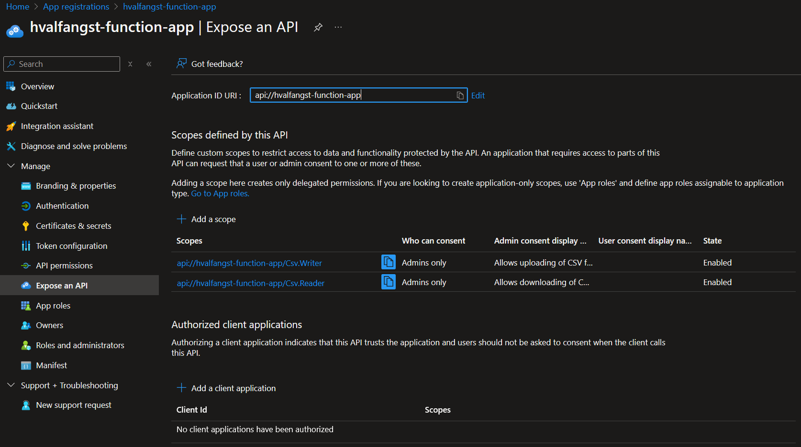

### App Registration for SPA

Has a redirect URI configured to the static web app's URL and the permissions **Csv.Writer** and the OIDC ones.

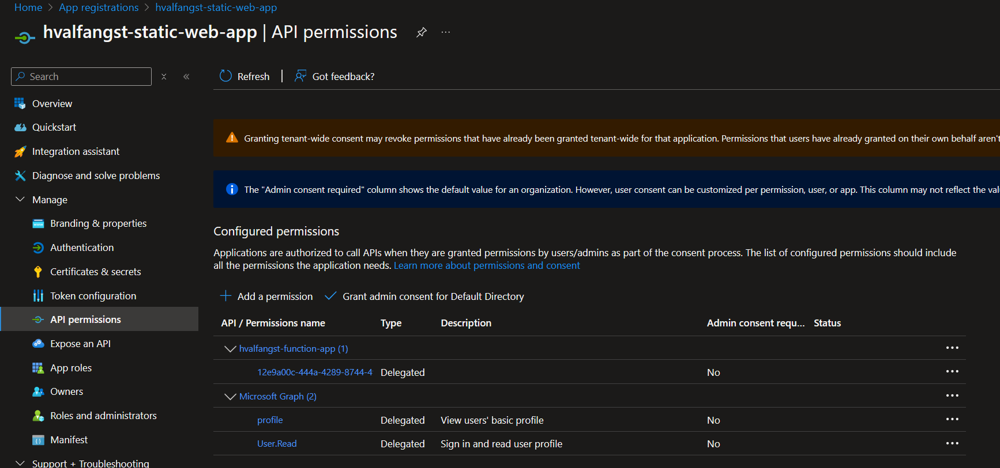


## GitHub secrets
Four secrets are required in order for the GitHub Actions Workflow script to deploy the code to the Azure resources. 
As may be observed in the [script](.github/workflows/deploy_to_azure.yml), these are:

- **AZURE_GITHUB_SP_CLIENT_ID**: Used to authenticate the service principal in order to deploy the static web app
- **AZURE_SUBSCRIPTION_ID**: Used to authenticate the service principal in order to deploy the static web app
- **AZURE_TENANT_ID**: Used to authenticate the service principal and for the OIDC flow in the React SPA
- **PUBLISH_PROFILE**: Used to deploy our two functions to the Azure Function App
- **STATIC_WEB_APP_CLIENT_ID**: Used in the React SPA for OIDC authentication

### Subscription and Tenant ID
The **subscription ID** and **tenant ID** is found by running the following Azure CLI command:

```bash
az account show --query id
az account show --query tenantId
```

### Publish Profile
The publish profile may be obtained by navigating to the Azure Portal, selecting the Azure Function App, and clicking on **Get publish profile**.

### Azure GitHub Service Principal
The service principal used for GitHub Actions is created as part of our resource provisioning script and
as thus should be displayed in the terminal output as such:

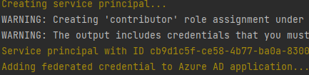

### Static Web App Client ID
Similarly, the **client ID** for the static web app is created as part of our resource provisioning script and outputted to the terminal as such:

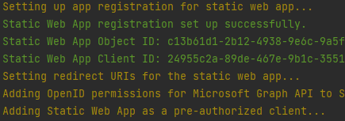

## Usage
After provisioning resources, setting up secrets, and pushing the code to the repository, one
may access the static web app by navigating to the following URL:


https://hvalfangststorageaccount.z6.web.core.windows.net, which results in the following.

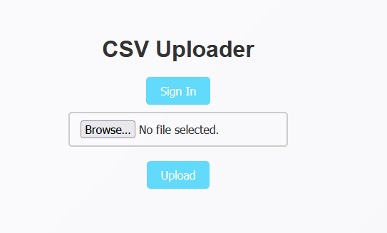

Click on **Sign In** to initiate the OIDC flow - which redirects to the Azure AD permission consent screen.

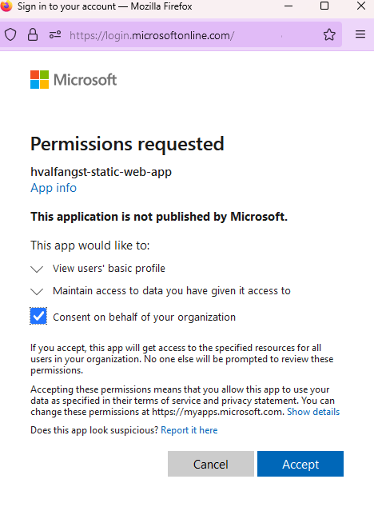

Clik on **Accept** and check off the **Consent on behalf of your organization** box to be redirected back to the SPA, where you will be greeted with the following.

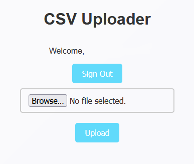

Proceed to click on **Upload** to choose a file to upload. Pick the CSV file named [input](input.csv) which has been provided for this purpose.

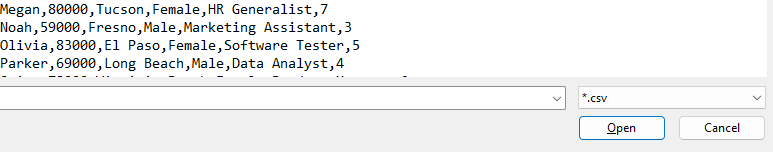

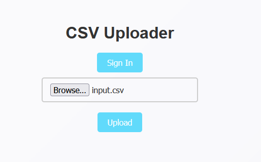

The file name will be displayed in the input field. Click on **Upload** to attempt to upload the file to the storage blob.

If the upload was successful, the following message will be displayed.

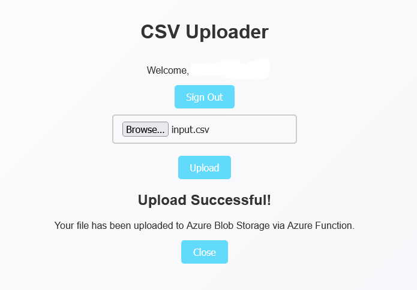