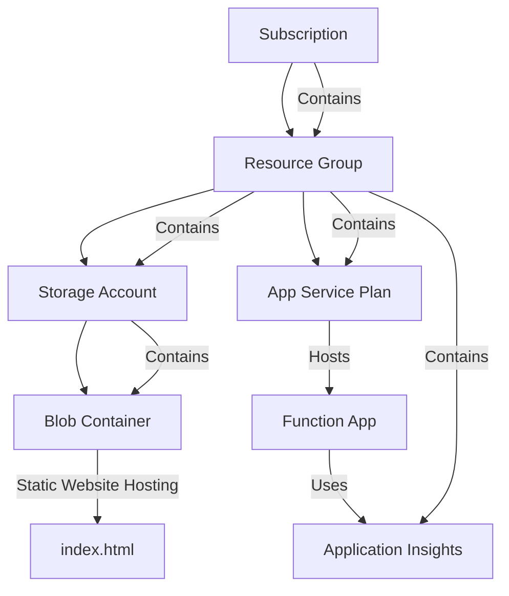

# Static web app invoking Azure functions

Static web app built with the React framework. The [application](client/src/App.js) allows users to upload CSV files to a storage blob via an HTTP-triggered function.
The uploaded files are then processed by a blob-triggered function, which stores the results in a separate container. Aforementioned functions
are present in the [function_app.py](hvalfangst_function/function_app.py) python script - which is the main entrypoint of our Azure Function App instance.

A pipeline has been set up to deploy the function app and the static web app to Azure using GitHub Actions. The pipeline is triggered by a push to the main branch or by manually running the workflow.

## Requirements

- **Platform**: x86-64, Linux/WSL
- **Programming Languages**: [React](https://reactjs.org/docs/getting-started.html), [Python 3](https://www.python.org/downloads/)
- **Cloud Account**: [Azure](https://azure.microsoft.com/en-us/pricing/purchase-options/azure-account)
- **Resource provisioning**: [Azure CLI](https://learn.microsoft.com/en-us/cli/azure/)

## Allocate resources

The shell script [allocate_resources](infra/allocate_resources.sh) creates Azure resources specified in a
[Bicep](https://learn.microsoft.com/en-us/azure/azure-resource-manager/bicep/overview?tabs=bicep) template [file](infra/main.bicep).

It will create the following hierarchy of resources:

## Deallocate resources

The shell script [deallocate_resources](infra/deallocate_resources.sh) deletes our Azure resources.

# CI/CD

A CI/CD pipeline for deploying our [Function App](hvalfangst_function/function_app.py) to Azure has been set up using a GitHub Actions workflows [script](.github/workflows/deploy_to_azure.yml). The pipeline is either triggered by a push to the main branch or by manually running the workflow. 
In order for the pipeline to work, the following secrets must be set in the repository settings:

The associated values of the aforementioned secret can be retrieved from the Azure portal, under our deployed Function App.
Click on the **Get publish profile** button and copy/paste the file content into the secret value field.

