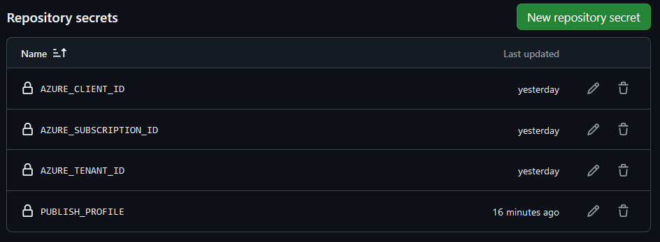

# Static web app invoking Azure functions

The aim of this repository is to demonstrate how to deploy a [static website](client/src/App.js) written in React to a [Storage Blob](https://learn.microsoft.com/en-us/azure/storage/blobs/storage-blob-static-website). The
hosted SPA allows users to upload CSV files containing demographic and financial data about individuals. The files are uploaded to a storage blob by calling an HTTP-triggered Azure Function with the appropriate output bindings. 
Once the CSV has been uploaded to the storage blob, another, blob-triggered Azure Function calculates correlations between various variables, such as experience, state, gender, and income. 
The computed statistics are then stored in a new blob container, which is used to serve the results to the user.
These two functions are defined in the python script [function_app.py](hvalfangst_function/function_app.py) - which is the main entrypoint of our Azure Function App instance.

The associated Azure infrastructure is deployed with a script (more on that below).

A branch-triggered pipeline has been set up to deploy our code to the respective Azure resources using a GitHub Actions Workflows [script](.github/workflows/deploy_to_azure.yml). 
The two functions are deployed using the Function App's associated **publish profile**, whereas the static web app is deployed using a **Service Principal** configured with a **Federated Credential**. 
Note that the static website is hosted directly from a storage blob, as our associated storage container has been configured to serve static websites in our resource provisioning script. 
Thus, deploying the website is simply a matter of uploading the static files to the designated blob container.

## Requirements

- **Platform**: x86-64, Linux/WSL
- **Programming Languages**: [React](https://reactjs.org/docs/getting-started.html), [Python 3](https://www.python.org/downloads/)
- **Cloud Account**: [Azure](https://azure.microsoft.com/en-us/pricing/purchase-options/azure-account)
- **Resource provisioning**: [Azure CLI](https://learn.microsoft.com/en-us/cli/azure/)

## Allocate resources

The shell script [allocate_resources](infra/allocate_resources.sh) creates Azure resources using the Azure CLI and a
[Bicep](https://learn.microsoft.com/en-us/azure/azure-resource-manager/bicep/overview?tabs=bicep) template [file](infra/main.bicep). 

It will create the following hierarchy of resources:

## GitHub secrets
Four secrets are required in order for the GitHub Actions Workflow script to deploy the code to the Azure resources. 
As may be observed in the [script](.github/workflows/deploy_to_azure.yml), these are:

- **AZURE_CLIENT_ID**: Used to authenticate the service principal in order to deploy the static web app
- **AZURE_SUBSCRIPTION_ID**: Used to authenticate the service principal in order to deploy the static web app
- **AZURE_TENANT_ID**: Used to authenticate the service principal in order to deploy the static web app
- **PUBLISH_PROFILE**: Used to deploy our two functions to the Azure Function App

